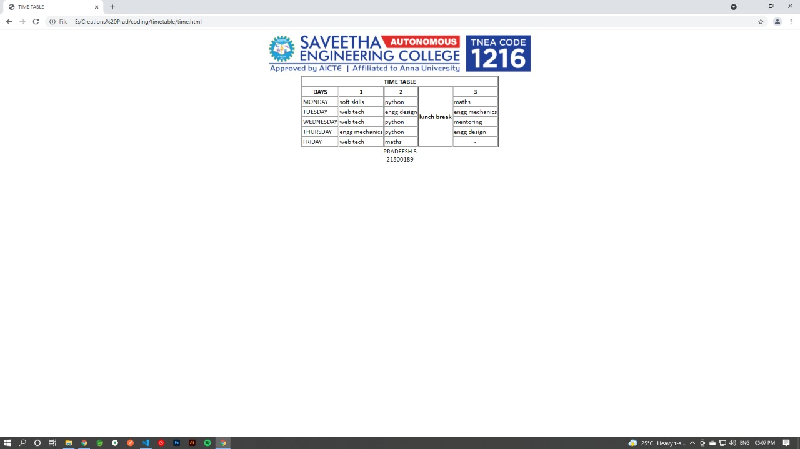

# Experiment_Time_Table

## AIM
To Write a html webpage page to display your timetable.

# ALGORITHM
### STEP 1
create a simple table using table tag
### STEP 2
Add header row using th tag
### STEP 3
Add your timetable
### STEP 4
Execute the program

# CODE
```
<!DOCTYPE html>
<html>


   <head>
      <title>TIME TABLE</title>
   </head>
	
   <body>
      <center>
       
       <font face="calibri">
      <table border = "1" cellspacing="1">
         <tr>
            <th colspan="8">TIME TABLE</th>
         </tr>
         
         <tr>
            <th>DAYS</th>
            <th>1</th>
            <th>2</th>
            <th rowspan="6">lunch break</th>
            <th>3</th>
            
            
            
         </tr>
          <tr>
             <td>MONDAY</td>
             <td>soft skills</td>
             <td>python</td>
             <td>maths</td>
             
             
         </tr>
         <tr>
            <td>TUESDAY</td>
            <td>web tech</td>
            <td>engg design</td>
            <td>engg mechanics</td>
            
            
        </tr>
        <tr>
            <td>WEDNESDAY</td>
            <td>web tech</td>
            <td>python</td>
            <td>mentoring</td>
            
            
        </tr>
        <tr>
            <td>THURSDAY</td>
            <td>engg mechanics</td>
            <td>python</td>
            <td>engg design</td>
            
            
        </tr>
        <tr>
            <td>FRIDAY</td>
            <td>web tech</td>
            <td>maths</td>
            <td align =center>-</td>
            
            
        </tr>
  
         
      </table>
      PRADEESH S <br>
      21500189
      </font>
      </center>
   </body>
</html>
```
# OUPUT


